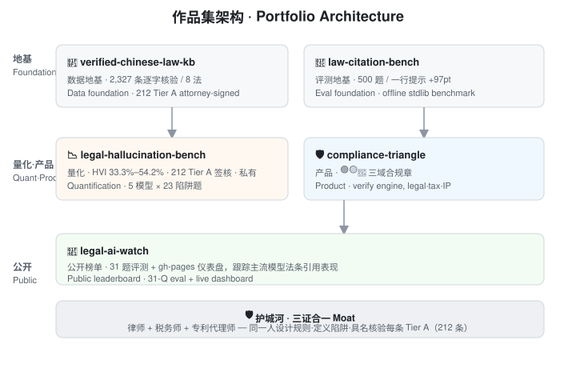

# Hi, I'm Vicky Wu 👋

**律师 + 税务师 + 专利代理师 ｜ 在做 AI 法律产品**
**Lawyer · Tax Adviser · Patent Attorney → building AI legal-product & compliance tooling that *measures* LLM quality.**

我把十年的法律 / 税务 / 知识产权实务经验，翻译成一套**可量化、可复现的 AI 质量评测与防护产品**——不是只会调 prompt，而是能把"模型错了"变成"可度量、可修复的规格"。
I turn a decade of legal / tax / IP practice into AI-quality evaluation and guardrail tooling that is *quantifiable and reproducible* — turning vague "the model is wrong" into a measured, fixable specification.

---

## 📦 作品集（5 个仓库 · 4 公开 1 私有）· Portfolio — 5 repos (4 public · 1 private)

| 仓库 Repo | 角色 Role | 一句话 One-liner |
| --- | --- | --- |
| [🧱 verified-chinese-law-kb](https://github.com/vickywu97/verified-chinese-law-kb) | **数据地基 · Data foundation** | 8 部法律、**2,327 条**逐字核验法条，律师具名、可独立下载模块 / 2,327 line-by-line verified articles across 8 laws, attorney-signed, independently downloadable. |
| [🔬 law-citation-bench](https://github.com/vickywu97/law-citation-bench) | **评测地基 · Eval foundation** | 离线零依赖基准，500 题量化法条引用准确率；一行提示词修复回收 **+97 分** / offline stdlib benchmark, 500 Q, a one-line prompt fix recovered +97 pts. |
| [📉 legal-hallucination-bench](https://github.com/vickywu97/legal-hallucination-bench) *(私有 · private)* | **量化基准 · Quantification** | 5 国产模型 × 23 陷阱题，HVI **33.3%–54.2%**，8 法域逐字 EXACT 全 0% / 5 models × 23 traps, HVI 33.3–54.2%, 8 laws EXACT all 0%. |
| [🛡️ compliance-triangle](https://github.com/vickywu97/compliance-triangle) | **产品 · Product** | 同一套 verify 引擎给每条 AI 引注盖 🟢🟡🔴 章（法律·税务·IP 三域）/ same verify engine → 🟢🟡🔴 stamps across legal·tax·IP. |
| [📡 legal-ai-watch](https://github.com/vickywu97/legal-ai-watch) | **公开榜单 · Public leaderboard** | 31 题公开评测 + gh-pages 仪表盘，跟踪主流模型法条引用表现 / 31-Q public eval + live dashboard. |

---

## 🛡️ 护城河（三证合一）· Moat — triple qualification

- **律师 Lawyer** —— 懂"引用法条"在法律实务里有多严肃 → 定下逐字二元判定。 / understands how serious citation is in practice → defines the exact-match binary criterion.
- **税务师 Tax Adviser** —— 把增值税法 / 企税 / 个税优先纳入（多数法律 AI 评测不碰税法）。 / prioritizes tax law (most legal-AI evals avoid it).
- **专利代理师 Patent Attorney** —— 职业习惯是"精确比对文本" → 与基准"一个字都不能差"同一思维。 / habit of precise text comparison → same mindset as "not one character off".

同一人设计校验规则、定义陷阱、签署每一条 KB——这是任何纯工程 / 纯算法团队无法复制的壁垒。
One person designs the rules, defines the traps, and signs every KB entry — a barrier no pure-engineering team can replicate.

---

## 📊 关键数字（无可辩驳）· Key numbers

- 测试规模 Scale：**5 国产模型 × 23 陷阱题 = 115 条**有效回答 / 115 valid responses.
- 引注幻觉率 HVI（最宽松尺度）：**33.3%–54.2%**（连付费旗舰都不过半）/ even paid flagships fail half.
- 内容级 EXACT（逐字合规率）：**8 法域全部 0%** / 8 laws all 0% exact match.
- 知识库 KB：**2,327 条**逐字核验法条 · **8 部法律** / KB: 2,327 verified articles · 8 laws.
- 评测基准 Benchmark：**500 题**确定性生成，T1 接地 / T2 检索 / T3 幻觉 / 500 deterministic questions.

---

## 🧰 技术标签 · Skills

`Python 标准库` · `离线零依赖` · `可复现评测` · `LLM 评测` · `法律 AI` · `税务合规` · `知识产权` · `产品设计`
`Python stdlib` · `offline-zero-dep` · `reproducible eval` · `LLM evaluation` · `legal AI` · `tax compliance` · `IP` · `product design`

---

## 📫 联系 · Reach me

欢迎 AI 法律 / 合规方向的团队交流：在任意仓库开 Issue，或通过 LinkedIn / 邮件联系。
Open to AI-legal / compliance roles — open an Issue on any repo, or reach me via LinkedIn / email.

> 注：评测结果与数字随版本演进，最新以各仓库 README 为准；本页仅作作品集导航，不构成法律 / 税务 / 专利意见。
> Numbers evolve with versions; latest per-repo READMEs are authoritative. This page is navigation only, not legal / tax / patent advice.
